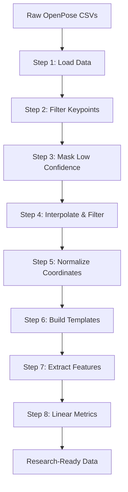

# Facial Pose Analysis System: Complete Documentation

## Table of Contents
1. [Overview](#overview)
2. [Quick Start](#quick-start)
3. [Data Input Format](#data-input-format)
4. [Pipeline Architecture](#pipeline-architecture)
5. [The 8-Step Processing Workflow](#the-8-step-processing-workflow)
6. [Utility Modules](#utility-modules)
7. [Feature Extraction](#feature-extraction)
8. [Configuration and Settings](#configuration-and-settings)
9. [Output Files and Structure](#output-files-and-structure)
10. [Understanding the Results](#understanding-the-results)
11. [Troubleshooting](#troubleshooting)

---

## Overview

This system analyzes facial pose data from OpenPose or similar landmark detection systems to extract meaningful behavioral and physiological metrics. The system is designed to process large datasets efficiently while maintaining scientific rigor.

### What This System Does

The facial pose analysis system takes raw landmark coordinates (like eye positions, mouth corners, etc.) and transforms them into research-ready metrics such as:

- **Head movement patterns** (rotation, translation, scale changes)
- **Blink behavior** (eye aperture measurements)
- **Mouth movement** (speaking, expressions)
- **Pupil tracking** (gaze patterns)
- **Overall facial motion** (stability, variability)

### Key Features

- **Robust processing**: Handles missing data, low-confidence detections, and noise
- **Multiple normalization methods**: Original coordinates, global alignment, and participant-specific alignment
- **Smart caching**: Skips already-processed steps to save time
- **Comprehensive output**: Per-frame details, windowed summaries, and linear motion metrics
- **Research-ready**: Statistical analysis tools and publication-quality visualizations

---

## Quick Start

### Complete Analysis Workflow

Follow these steps in order to analyze your pose data:

#### 1. Run the Pose Processing Pipeline (Required)
```bash
# Navigate to the pose directory
cd pose/

# Run the complete 8-step pipeline
python process_pose_data.py

# Force reprocessing of all steps (if needed)
python process_pose_data.py --overwrite

# Get help
python process_pose_data.py --help
```

#### 2. Generate Statistical Analysis and Figures (Required)
```bash
# Open and run the statistical analysis notebook
jupyter notebook pose_stats_figures.ipynb
```

This notebook will:
- Load processed linear metrics from all three normalization methods
- Perform statistical analysis (mixed-effects models or Python fallback)
- Generate publication-ready bar plots with significance testing
- Save results to `pose_stats_summary.csv` and figures to `./figs/`

#### 3. Visualize Processing Pipeline (Optional)
```bash
# Open the processing visualization notebook
jupyter notebook pose_processing_visualisation.ipynb
```

This notebook provides:
- Visual inspection of the 8-step processing pipeline
- Data quality assessment plots
- Per-participant processing summaries
- Diagnostic plots for troubleshooting

---

## Data Input Format

### Expected File Structure

Your data should be organized as:
```
data/
├── raw_data/
│   ├── participant_info.csv     # Condition mapping
│   ├── 3101_01_pose.csv        # Participant 3101, Trial 1
│   ├── 3101_02_pose.csv        # Participant 3101, Trial 2
│   ├── 3102_01_pose.csv        # Participant 3102, Trial 1
│   └── ...
└── processed/                   # Output directory (created automatically)
```

### CSV File Format

Each pose CSV contains landmark coordinates with this structure:
```csv
x1,y1,prob1,x2,y2,prob2,...,x70,y70,prob70
245.3,156.7,0.92,248.1,158.2,0.89,...
```

**Columns:**
- `x1,y1,prob1`: Coordinates and confidence for landmark 1
- `x2,y2,prob2`: Coordinates and confidence for landmark 2
- ...and so on for all 70 landmarks

**Landmarks:**
- **1-68**: Standard MediaPipe/OpenPose facial landmarks
- **69-70**: Left and right pupils (if available)
- **Key landmarks**: 37,46 (eye corners), 63,67 (mouth corners), 28-36 (nose bridge)

### Participant Information File

`participant_info.csv` maps trials to experimental conditions:
```csv
Participant ID,Session1,Session2,Session3
3101,L,M,H
3102,H,L,M
```
- **Participant ID**: Must match the filename prefix
- **Session1/2/3**: Experimental conditions (L=Low, M=Medium, H=High workload)

---

## Pipeline Architecture

The system follows a linear 8-step process, with each step building on the previous one:



### Smart Processing Features

- **Automatic skip logic**: If normalized files already exist, skips steps 1-5
- **Configurable processing**: Enable/disable any step through configuration flags
- **Error recovery**: Robust handling of missing data and processing failures
- **Progress tracking**: Clear progress bars and status messages

---

## The 8-Step Processing Workflow

### Step 1: Load Raw Data
**Purpose**: Read OpenPose CSV files and perform basic validation

**What happens:**
- Loads all CSV files from the raw data directory
- Validates file format and column structure
- Reports any loading failures

**Output**: Raw landmark data in memory

### Step 2: Filter to Relevant Keypoints
**Purpose**: Keep only the facial landmarks needed for analysis

**Key landmarks retained:**
- **Eyes**: 37-48 (for blink detection and head rotation)
- **Nose**: 28-36 (for face centering and stability)
- **Mouth**: 63,67 (for mouth movement)
- **Pupils**: 69,70 (for gaze tracking)

**What happens:**
- Detects confidence column naming (prob*, c*, confidence*)
- Extracts only relevant (x,y,confidence) triplets
- Reduces data size by ~70%

**Output**: `*_reduced.csv` files (if saving enabled)

### Step 3: Mask Low-Confidence Landmarks
**Purpose**: Set unreliable detections to NaN for robust analysis

**Process:**
- Any landmark with confidence < threshold (default 0.30) is masked
- Coordinates set to NaN (not removed) to preserve temporal structure
- Statistics tracked for quality assessment

**Output**: `*_masked.csv` files with unreliable points removed

### Step 4: Interpolate Short Gaps and Filter
**Purpose**: Clean the data and reduce noise

**Interpolation:**
- Linear interpolation for gaps ≤ 60 frames (1 second at 60fps)
- Longer gaps remain as NaN to avoid unrealistic interpolation
- Applied per landmark independently

**Filtering:**
- Zero-phase Butterworth low-pass filter (10 Hz cutoff)
- Applied per contiguous segment to handle NaN gaps properly
- Removes high-frequency noise while preserving real movements

**Output**: `*_interp_filt.csv` files with clean, smooth trajectories

### Step 5: Normalize to Screen Coordinates
**Purpose**: Make coordinates independent of screen resolution

**Process:**
- X coordinates divided by screen width (2560) → range [0,1]
- Y coordinates divided by screen height (1440) → range [0,1]
- Enables comparison across different recording setups

**Output**: `*_norm.csv` files with resolution-independent coordinates

### Step 6: Build Templates (Global + Per-Participant)
**Purpose**: Create reference poses for Procrustes alignment

**Global Template:**
- Mean landmark positions across ALL participants and conditions
- Represents the "average" face pose in your dataset
- Used for global normalization

**Per-Participant Templates:**
- Mean landmark positions for each individual participant
- Accounts for individual facial geometry differences
- Used for participant-specific normalization

**Output**: Template CSV files for Procrustes alignment

### Step 7: Extract Windowed Features
**Purpose**: Convert raw coordinates into meaningful behavioral metrics

**Three Processing Routes:**

1. **Procrustes Global**: Align each frame to the global template
2. **Procrustes Participant**: Align each frame to participant's template
3. **Original**: Use raw normalized coordinates without alignment

**Windowing:**
- 60-second windows with 50% overlap (30-second steps)
- Each window becomes one data point
- Windows with ANY missing data are dropped per metric

**Core Features Extracted:**
- `head_rotation_rad`: Head rotation angle
- `blink_aperture`: Average eye opening
- `mouth_aperture`: Mouth opening distance
- `pupil_metric`: Pupil position variability
- `head_tx/ty/scale`: Translation and scale changes (Procrustes only)

**Output**:
- Windowed feature CSVs for statistical analysis
- Per-frame CSVs for detailed examination

### Step 8: Compute Linear Metrics
**Purpose**: Extract motion characteristics from the time series

**Linear Metrics per Feature:**
- **Mean Velocity**: Average speed of change
- **Mean Acceleration**: Average rate of velocity change
- **RMS**: Root-mean-square (overall variability)

**Interocular Scaling:**
- Optionally scale distance-based metrics by inter-eye distance
- Accounts for individual differences in facial size
- Makes metrics comparable across participants

**Output**: `*_linear.csv` files with motion statistics

---

## Utility Modules

The system is built with modular utilities that handle specific aspects of processing:

### `utils/config.py` - Configuration Management
**Purpose**: Centralized settings for all processing parameters

**Key Settings:**
- **Directories**: Input/output paths (configurable via environment variables)
- **Processing**: Frame rate, image dimensions, confidence thresholds
- **Filtering**: Butterworth filter parameters, interpolation limits
- **Features**: Window size, overlap, landmark indices
- **Flags**: Enable/disable each processing step

### `utils/io_utils.py` - File Operations
**Purpose**: Handle all file reading, writing, and directory management

**Key Functions:**
- `load_raw_files()`: Find and validate input CSV files
- `ensure_dirs()`: Create output directory structure
- `get_output_filename()`: Transform trial numbers to condition names
- `write_per_frame_metrics()`: Save detailed per-frame results
- `load_participant_info_file()`: Load condition mapping with smart path detection

### `utils/preprocessing_utils.py` - Data Processing
**Purpose**: Core data manipulation and filtering functions

**Key Functions:**
- `parse_participant_trial()`: Extract participant ID and trial number from filenames
- `create_condition_mapping()`: Build trial→condition lookup from participant info
- `confidence_mask()`: Apply confidence thresholding with detailed statistics
- `filter_df_to_relevant()`: Keep only necessary landmark columns
- `relevant_indices()`: Define which landmarks to process

### `utils/signal_utils.py` - Signal Processing
**Purpose**: Temporal filtering and interpolation

**Key Functions:**
- `interpolate_run_limited()`: Linear interpolation with maximum gap limits
- `butterworth_segment_filter()`: Zero-phase filtering per contiguous segment
- Smart handling of NaN values to avoid filter artifacts

### `utils/normalize_utils.py` - Coordinate Normalization
**Purpose**: Screen normalization and distance calculations

**Key Functions:**
- `normalize_to_screen()`: Convert pixel coordinates to [0,1] range
- `interocular_series()`: Calculate frame-by-frame eye distance
- Validation warnings for suspicious measurements

### `utils/geometry_utils.py` - Geometric Transformations
**Purpose**: Procrustes analysis and spatial transformations

**Key Functions:**
- `procrustes_frame_to_template()`: Solve similarity transform (translation, rotation, scale)
- Robust SVD-based alignment with error handling
- Template building from multiple pose samples

### `utils/features_utils.py` - Feature Extraction
**Purpose**: Convert coordinates to behavioral metrics

**Key Functions:**
- `procrustes_features_for_file()`: Extract features from Procrustes-aligned data
- `original_features_for_file()`: Extract features from raw coordinates
- `compute_linear_from_perframe_dir()`: Calculate velocity/acceleration metrics

### `utils/window_utils.py` - Temporal Analysis
**Purpose**: Windowing and temporal feature extraction

**Key Functions:**
- `window_features()`: Aggregate per-frame data into windows
- `linear_metrics()`: Calculate velocity, acceleration, RMS
- Smart NaN handling to drop contaminated windows

### `utils/stats_utils.py` - Statistical Analysis
**Purpose**: Hypothesis testing and group comparisons

**Key Functions:**
- `compare_groups_statistical()`: Automated statistical testing with normality checks
- ANOVA/t-tests vs Kruskal-Wallis/Mann-Whitney selection
- Holm-Bonferroni multiple comparison correction

---

## Feature Extraction

### Core Behavioral Metrics

The system extracts several key metrics that reflect different aspects of facial behavior:

#### Head Movement
- **`head_rotation_rad`**: Rotation angle of the head based on eye corner positions
  - Calculated as angle between eye corners (landmarks 37→46)
  - Reflects head turns and tilts
  - Units: radians

#### Eye Behavior
- **`blink_aperture`**: Average eye opening
  - Distance between upper and lower eyelids for both eyes
  - Reflects blink rate, eye closure, fatigue
  - Normalized by face size

#### Mouth Movement
- **`mouth_aperture`**: Mouth opening distance
  - Euclidean distance between mouth corners (landmarks 63,67)
  - Reflects speaking, expressions, jaw movement
  - Normalized by face size

#### Gaze Patterns
- **`pupil_metric`**: Pupil position variability
  - Distance of pupils from eye center positions
  - Reflects gaze direction changes, saccades
  - Averaged across both eyes

#### Procrustes-Specific Features (Advanced)
- **`head_tx/head_ty`**: Translation of head in X/Y directions
- **`head_scale`**: Size changes (distance from camera)
- **`head_motion_mag`**: Combined motion magnitude
- **`center_face_magnitude`**: Facial stability around nose region

### Three Analysis Routes

#### 1. Original Route
- Uses raw screen-normalized coordinates
- No geometric alignment
- Best for absolute position analysis
- Preserves individual differences

#### 2. Procrustes Global Route
- Aligns each frame to a global template (average of all participants)
- Removes individual geometry differences
- Best for comparing relative movements across participants
- Emphasizes deviations from population norm

#### 3. Procrustes Participant Route
- Aligns each frame to participant's own template
- Removes individual baseline but preserves personal movement patterns
- Best for within-participant comparisons across conditions
- Emphasizes deviations from personal baseline

---

## Configuration and Settings

### Environment Variables (Optional)
```bash
export POSE_RAW_DIR="/path/to/your/raw/data"
export POSE_OUT_BASE="/path/to/your/output"
export PARTICIPANT_INFO_FILE="my_participant_info.csv"
```

### Key Configuration Parameters

#### Processing Settings
```python
FPS = 60                    # Video frame rate
IMG_WIDTH = 2560           # Screen width for normalization
IMG_HEIGHT = 1440          # Screen height for normalization
CONF_THRESH = 0.30         # Minimum confidence threshold
MAX_INTERP_RUN = 60        # Maximum frames to interpolate (1 second)
```

#### Filtering Settings
```python
FILTER_ORDER = 4           # Butterworth filter order
CUTOFF_HZ = 10.0          # Low-pass filter cutoff frequency
```

#### Windowing Settings
```python
WINDOW_SECONDS = 60        # Window size (60 seconds)
WINDOW_OVERLAP = 0.5       # 50% overlap between windows
```

#### Processing Flags
```python
# Core processing steps
RUN_FILTER = True          # Apply filtering and interpolation
RUN_MASK = True            # Mask low-confidence landmarks
RUN_INTERP_FILTER = True   # Interpolate gaps and filter
RUN_NORM = True            # Normalize to screen coordinates
RUN_TEMPLATES = True       # Build alignment templates

# Feature extraction routes
RUN_FEATURES_PROCRUSTES_GLOBAL = True      # Global alignment
RUN_FEATURES_PROCRUSTES_PARTICIPANT = True # Participant alignment
RUN_FEATURES_ORIGINAL = True               # Original coordinates
RUN_LINEAR = True                          # Linear metrics

# File saving options
SAVE_REDUCED = True        # Save filtered landmarks
SAVE_MASKED = True         # Save after confidence masking
SAVE_INTERP_FILTERED = True # Save after interpolation/filtering
SAVE_NORM = True           # Save normalized coordinates

# Overwrite behavior
OVERWRITE = True           # Overwrite existing processed files
OVERWRITE_TEMPLATES = False # Preserve existing templates
```

---

## Output Files and Structure

The system creates a organized directory structure under `data/processed/`:

```
data/processed/
├── reduced/                    # Step 2 outputs
│   ├── 3101_L_reduced.csv
│   └── ...
├── masked/                     # Step 3 outputs
│   ├── 3101_L_masked.csv
│   └── ...
├── interp_filtered/            # Step 4 outputs
│   ├── 3101_L_interp_filt.csv
│   └── ...
├── norm_screen/               # Step 5 outputs (key for skipping)
│   ├── 3101_L_norm.csv
│   └── ...
├── templates/                 # Step 6 outputs
│   ├── global_template.csv
│   └── participant_3101_template.csv
├── features/                  # Step 7 outputs
│   ├── procrustes_global.csv           # Windowed features
│   ├── procrustes_participant.csv      # Windowed features
│   ├── original.csv                    # Windowed features
│   └── per_frame/                      # Detailed per-frame data
│       ├── procrustes_global/
│       │   ├── 3101_L_perframe.csv
│       │   └── all_perframe.csv        # Combined file
│       ├── procrustes_participant/
│       └── original/
├── linear_metrics/            # Step 8 outputs
│   ├── procrustes_global_linear.csv
│   ├── procrustes_participant_linear.csv
│   └── original_linear.csv
└── processing_summary.json    # Complete processing report
```

### Key Output Files for Analysis

#### Windowed Features (`features/*.csv`)
- **Primary files for statistical analysis**
- One row per analysis window (60s with 50% overlap)
- Columns: `source`, `participant`, `condition`, `frame`, `interocular`, + all feature metrics
- Ready for ANOVA, t-tests, regression analysis

#### Linear Metrics (`linear_metrics/*_linear.csv`)
- **Motion characteristics for each feature**
- Columns: participant, condition, metric name, mean_velocity, mean_acceleration, rms
- Useful for detecting movement disorders, fatigue, attention patterns

#### Per-Frame Data (`features/per_frame/*/all_perframe.csv`)
- **Detailed frame-by-frame measurements**
- Useful for time-series analysis, event detection
- Large files - use for detailed investigation only

#### Processing Summary (`processing_summary.json`)
- Complete record of processing parameters
- Quality metrics (masking statistics, dropped windows)
- Essential for reproducibility and quality assessment

---

### Interpreting Metrics

#### Head Rotation (`head_rotation_rad`)
- **Higher values**: More head movement, less stable posture
- **Lower values**: More stable, focused posture
- **Typical range**: 0-0.5 radians (0-30 degrees)

#### Blink Aperture (`blink_aperture`)
- **Higher values**: Eyes more open, alert
- **Lower values**: Eyes more closed, fatigue, blinks
- **Normalized units**: Relative to face size

#### Mouth Aperture (`mouth_aperture`)
- **Higher values**: More mouth opening, speaking
- **Lower values**: Mouth closed, silence
- **Normalized units**: Relative to face size

#### Motion Metrics (from linear analysis)
- **Mean Velocity**: How fast features are changing
- **Mean Acceleration**: How much velocity is changing
- **RMS**: Overall variability/stability

### Quality Assessment

#### Check Processing Summary
```python
import json
with open('data/processed/processing_summary.json', 'r') as f:
    summary = json.load(f)

# Check data quality
print(f"Files processed: {summary['files_processed']}")
print(f"Participants: {summary['participants']}")
print(f"Conditions: {summary['conditions']}")
```

#### Common Quality Indicators
- **High confidence masking** (>30% masked): Poor video quality or lighting
- **Many dropped windows**: Excessive missing data
- **Suspiciously small inter-ocular distances**: Face detection errors

---